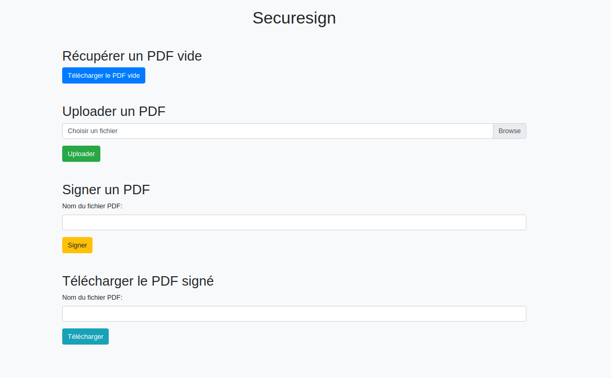

# SecureSign - Signature Électronique Sécurisée

SecureSign est une plateforme robuste de signature électronique. Elle est conçue pour faciliter la signature numérique de documents tout en assurant leur sécurité, leur authenticité et leur conformité légale.

## Fonctionnalités

- **Signature Électronique Légale** : Utilisez notre infrastructure pour signer vos documents électroniquement tout en respectant les normes et réglementations en vigueur. Chaque signature est accompagnée de métadonnées pour assurer sa traçabilité.

- **Gestion de Documents** : Importez et stockez vos documents numériques dans un espace dédié. L'application prend en charge les fichiers PDF, assurant leur intégrité tout au long du processus.

- **Collaboration en Ligne** : Envoyez des invitations à d'autres utilisateurs pour qu'ils signent vos documents, garantissant ainsi une fluidité dans les processus collaboratifs.

- **Horodatage et Intégrité** : Chaque document signé est horodaté, garantissant son authenticité et protégeant contre toute tentative de modification postérieure.

- **Sécurité Avancée** : Avec une infrastructure sécurisée, vos documents et données sont cryptés et protégés contre toute menace potentielle. Utilisation de certificats et clés privées pour assurer la sécurité et l'authenticité des signatures.

- **Vérification des Signatures** : Après la signature d'un document, il est possible de vérifier les métadonnées et les détails de la signature pour s'assurer de son authenticité.

## Comment ça marche?

1. **Importez votre Document** : Téléchargez votre fichier PDF dans l'application.
2. **Procédez à la Signature** : Après avoir importé votre document, utilisez votre certificat et votre clé privée pour le signer numériquement.
3. **Vérification** : Une fois le document signé, vous pouvez vérifier la signature à tout moment pour vous assurer de son authenticité.
4. **Stockage et Gestion** : Les documents signés sont stockés en toute sécurité et peuvent être facilement gérés et récupérés via l'interface de l'application.

## Installation et Configuration

La mise en place et la configuration de SecureSign nécessitent un environnement GoLang. Assurez-vous d'avoir également les dépendances nécessaires, telles que `gin-gonic/gin` et `digitorus/pdf`.

- Clonez le répertoire.
- Installez les dépendances.
- Configurez vos chemins pour les certificats et clés privées.
- Exécutez l'application et commencez à signer!

